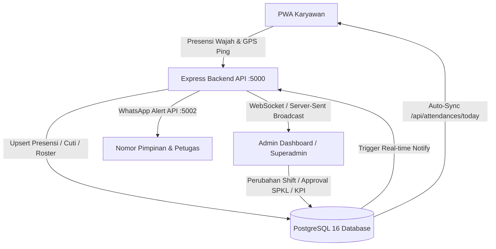

# Enterprise HRIS Orchestrator: Complete Architecture, Standard & Workflow

Standar rekayasa perangkat lunak enterprise untuk pengelolaan sistem informasi sumber daya manusia (HRIS - *Human Resource Information System*) modern. Menjamin integrasi mulus antara operasional presensi harian, penjadwalan shift, kepatuhan lembur resmi (PP 35/2021), cuti & izin, evaluasi kinerja KPI, penegakan kedisiplinan, analitik visual bulanan, serta impor/ekspor laporan dalam format PDF dan Excel (XLSX).

---

## 1. Modul Presensi & Kehadiran (Time & Attendance)

### A. Geofencing & GPS Multi-Titik Dinamis
1. **Haversine Spherical Metric & Ray-Casting Polygon:**
   - Jarak dihitung menggunakan formula Haversine dengan koreksi kelengkungan bumi ($R = 6.371.000\text{ m}$):
     $$d = 2R \arcsin\left(\sqrt{\sin^2\left(\frac{\Delta \varphi}{2}\right) + \cos(\varphi_1)\cos(\varphi_2)\sin^2\left(\frac{\Delta \lambda}{2}\right)}\right)$$
2. **Hysteresis Schmitt-Trigger (Anti-Flapping):**
   - **Entry Threshold:** $\text{Distance} \le \text{Radius} + \text{AccuracyBuffer}$ (Memicu status `inside`).
   - **Exit Threshold:** $\text{Distance} > \text{Radius} + \text{AccuracyBuffer} + 35\text{ meter}$ (Mencegah GPS jitter di perbatasan mengubah status berulang kali).
3. **Dynamic Multi-Post Bank:**
   - Karyawan lapangan/patroli dapat memiliki multi-titik pos yang tersimpan di `hrm_field_assigned_posts`. Presensi masuk dan pulang sah di titik pos manapun yang terdaftar.

### B. Biometrik 1:1 & Presentation Attack Detection (Liveness)
1. **Master Embedding Vector:**
   - Pendaftaran wajah 128-D feature vector diekstraksi dari multi-frame (sudut depan, toleh kanan 15°, toleh kiri 15°).
2. **Verifikasi Euclidean & Cosine Distance:**
   - Verifikasi 1:1 antara vektor live dan vektor master:
     $$\text{Distance} = \sqrt{\sum_{i=1}^{128} (v_{\text{live}, i} - v_{\text{master}, i})^2}$$
   - Threshold ketat: $\text{Distance} \le 0.45$ (Confidence $\ge 85\%$).
3. **Active/Passive Liveness Protection (Anti-Foto / Layar):**
   - Deteksi kedipan mata (*Eye Aspect Ratio* < 0.20), variasi kontur wajah mikro, dan penolakan foto statis/cetakan kertas.

### C. Multi-Device Protection & Hardware Binding
- Karyawan hanya dapat melakukan presensi dari 1 perangkat terdaftar (*Single Device Binding*).
- Login pertama kali mengunci `device_id` dan `device_model` di tabel `hrm_profiles`.
- Percobaan login dari perangkat lain otomatis diblokir (*Error 403: DEVICE_BINDING_MISMATCH*) kecuali telah direset oleh Superadmin.

---

## 2. Modul Penjadwalan Shift & Roster (Roster & Shift Management)

### A. Pola Shift Dinamis (3 Shift & 24/7 Rotasi)
Sistem mendukung konfigurasi shift fleksibel:
- **Day Shift (Reguler):** 07:30 – 16:30 WITA (Toleransi keterlambatan 15 menit).
- **Shift I (Pagi):** 07:30 – 15:30 WITA.
- **Shift II (Sore):** 15:30 – 22:30 WITA.
- **Shift III (Malam):** 22:30 – 07:30 WITA.

### B. Validasi Kepatuhan Regulasi Ketenagakerjaan
1. **Mandatory 11-Hour Rest Interval (UU Ketenagakerjaan):**
   - Antara jam selesai shift sebelumnya dengan jam mulai shift berikutnya **wajib berjarak minimal 11 jam berturut-turut**.
   - Sistem melakukan **Hard-Block** jika ada penetapan shift yang melanggar jeda istirahat (contoh: Shift III malam langsung lanjut Shift I pagi berikutnya).
2. **Batas Jam Kerja 40 Jam/Minggu:**
   - Peringatan dini jika jadwal seorang karyawan dalam satu minggu berjalan melebihi 40 jam kerja reguler.

### C. Alur Tukar Shift (Shift Swap Workflow)
1. **Inisiasi oleh Karyawan:** Karyawan A memilih tanggal & shift yang ingin ditukar, serta memilih rekan Karyawan B pengganti.
2. **Persetujuan Rekan:** Karyawan B menerima notifikasi in-app & WhatsApp untuk mengonfirmasi kesediaan bertukar.
3. **Validasi Anti-Bentrok Sistem:** Sistem memeriksa apakah Karyawan B memiliki jadwal pada jam yang sama atau melanggar jeda istirahat 11 jam.
4. **Persetujuan Atasan (Supervisor/Danru Approval):** Setelah divalidasi sistem, atasan memberikan approval digital. Kalender roster otomatis terbarui tanpa mengacaukan rekapitulasi data.

---

## 3. Modul Manajemen Lembur (Digital Overtime Tracking - SPKL)

### A. Surat Perintah Kerja Lembur (SPKL) Digital
- Alur approval 2 tingkat: Pengajuan pra-lembur (estimasi jam & uraian tugas) $\rightarrow$ Validasi atasan $\rightarrow$ Pelaksanaan lembur (disertai foto bukti di lokasi) $\rightarrow$ Approval verifikasi jam aktual.

### B. Formula Pengali Lembur Sesuai PP No. 35/2021
Perhitungan upah per jam dasar:
$$\text{Upah Sejam} = \frac{1}{173} \times (\text{Gaji Pokok} + \text{Tunjangan Tetap})$$

1. **Lembur pada Hari Kerja Biasa:**
   - Jam ke-1: Dihitung **$1.5 \times \text{Upah Sejam}$**.
   - Jam ke-2 dan seterusnya: Dihitung **$2.0 \times \text{Upah Sejam}$**.
   - Maksimal lembur hari kerja: 4 jam/hari dan 18 jam/minggu.
2. **Lembur pada Hari Istirahat Mingguan / Libur Resmi (6 Hari Kerja):**
   - Jam ke-1 s/d Jam ke-7: Dihitung **$2.0 \times \text{Upah Sejam}$**.
   - Jam ke-8: Dihitung **$3.0 \times \text{Upah Sejam}$**.
   - Jam ke-9 s/d Jam ke-11: Dihitung **$4.0 \times \text{Upah Sejam}$**.
3. **Otomatisasi Payroll:**
   - Seluruh jam lembur yang telah berstatus `approved` otomatis dijumlahkan dan dimasukkan ke komponen pendapatan slip gaji periode berjalan.

---

## 4. Modul Manajemen Izin & Cuti (Leave & Absence Management)

### A. Saldo Cuti Real-Time & Ledger Transaksi
- Hak cuti tahunan (default 12-14 hari/tahun) dicatat dengan model buku besar (*debit/credit ledger*).
- Setiap approval cuti langsung mengurangi kuota aktif dan mencatat saldo sisa di tabel `hrm_leave_requests` dan `hrm_profiles.annual_leave_quota`.

### B. Kategori Cuti Khusus Sesuai Regulasi
- **Cuti Tahunan:** Pengurangan kuota tahunan.
- **Cuti Sakit:** Wajib lampiran Surat Keterangan Dokter (SKD) jika $> 1$ hari.
- **Cuti Melahirkan/Maternity:** 3 bulan (upah penuh dibayarkan).
- **Cuti Menikah:** 3 hari (tanpa potong gaji).
- **Cuti Duka / Anggota Keluarga Meninggal:** 2 hari.
- **Izin Darurat / Pulang Cepat:** Terintegrasi langsung dengan pembebasan alarm geofence di PWA karyawan.

### C. Team Calendar & Pencegahan Kekosongan Kuota (Zero-Vacancy)
- Visualisasi kalender departemen menampilkan seluruh personil yang sedang cuti dalam rentang tanggal tertentu.
- Sistem memberi peringatan jika personil aktif di satu shift/divisi turun di bawah kuota minimum operasional.

---

## 5. Modul Manajemen Kinerja (Performance Management & KPI)

### A. Struktur KPI / OKR Terintegrasi Presensi
1. **Komponen Kehadiran & Disiplin (Bobot 30%):**
   - Dihitung otomatis dari metrik presensi database:
     $$\text{Discipline Score} = 100 - (\text{LateCount} \times 2) - (\text{AlphaCount} \times 10) - (\text{BreachCount} \times 5)$$
2. **Komponen Target Operasional Lapangan (Bobot 50%):**
   - Pencapaian volume tugas, verifikasi patroli barcode/titik pos, dan ketepatan penyelesaian order.
3. **Komponen Evaluasi Kompetensi & Sikap (Bobot 20%):**
   - Penilaian integritas, kerjasama tim, dan inisiatif.

### B. Evaluasi 360 Derajat & Review Berkala
- Formulir evaluasi digital: Penilaian Mandiri (*Self-Appraisal*) $\rightarrow$ Ulasan Rekan Sejawat (*Peer Review*) $\rightarrow$ Evaluasi Atasan Langsung (*Manager Review*).
- Rating skala Likert 1-5 dengan catatan deskriptif objektif.

---

## 6. Modul Pelanggaran & Kedisiplinan (Disciplinary Tracking)

### A. Klasifikasi Sanksi & Surat Peringatan (SP 1, SP 2, SP 3)
- **Teguran Lisan / Warning Note:** Keterlambatan kumulatif $> 60$ menit dalam 1 bulan.
- **Surat Peringatan I (SP 1):** Masa berlaku 6 bulan sesuai UU Ketenagakerjaan.
- **Surat Peringatan II (SP 2):** Pelanggaran berulang dalam masa aktif SP 1.
- **Surat Peringatan III (SP 3 / Terakhir):** Pelanggaran berat atau akumulasi SP 2.

### B. Audit Trail & Berita Acara Pemeriksaan (BAP) Digital
- Setiap insiden perimeter breach, manipulasi fake GPS, atau mangkir tanpa keterangan menghasilkan catatan forensik di tabel `hrm_perimeter_violations` dan `hrm_notifications`.
- Dilengkapi bukti koordinat GPS, foto biometrik ber-watermark permanen, dan tanda tangan digital supervisor.

---

## 7. Visualisasi Analitik Bulanan & Dashboard Eksekutif

Dashboard analitik bulanan menyediakan metrik visual komprehensif bagi Dirut dan Pimpinan:
1. **Attendance Rate Card:** Persentase kehadiran seluruh departemen (Target $\ge 95\%$).
2. **Late Arrival Distribution Curve:** Grafik sebaran menit keterlambatan per divisi dan shift.
3. **Overtime Cost Breakdown:** Total pengeluaran jam lembur versus jam kerja produktif.
4. **Geofence Incident Heatmap:** Peta sebaran titik-titik lokasi perimeter breach dan patroli lapangan.
5. **Department Performance Ranking:** Matriks komparasi kedisiplinan dan produktivitas antar regu.

---

## 8. Standar Ekspor PDF, Excel (XLSX) & Mesin Impor Template

### A. Ekspor Laporan Excel Profesional (XLSX)
Menggunakan library `exceljs` atau `xlsx` dengan standar tata letak korporat:
- **Header Resmi:** Nama Perusahaan (`PT. FAWWAZ RESKI PERWIRA`), Judul Laporan, Periode Bulan, dan Timestamp WITA.
- **Multi-Sheet Workbook:**
  - *Sheet 1: Rekap Presensi & Kehadiran (Hadir, Telat, Izin, Sakit, Cuti, Alpha)*
  - *Sheet 2: Rekapitulasi Lembur (SPKL, Jam Riil, Jam Pengali, Total Upah Lembur)*
  - *Sheet 3: Riwayat Kedisiplinan & Pelanggaran (SP, Menit Terlambat, Catatan)*
  - *Sheet 4: Evaluasi Skor KPI & Peringkat Karyawan*
- **Formatting:** Auto-fit column widths, freeze header panes, border tabel tipis standar akuntansi, dan warna status dinamis (Hijau = Hadir Tepat Waktu, Kuning = Terlambat, Merah = Alpha).

### B. Ekspor Dokumen Resmi PDF
Menggunakan `jspdf` dan `jspdf-autotable`:
- Kop surat resmi instansi dengan logo perusahaan resolusi tinggi.
- Watermark identitas rahasia dokumen.
- Kolom tanda tangan resmi: Disiapkan oleh (HRD), Diperiksa oleh (Manager Ops), dan Disetujui oleh (Direktur Utama).

### C. Mesin Impor Fleksibel (Template Importer)
Mesin impor toleran format yang memetakan kolom secara heuristik dari berkas `.xlsx` atau `.csv`:
1. **Heuristic Header Mapping:**
   - NIP / ID: `['nip', 'id karyawan', 'nomor induk', 'employee id', 'nik']`
   - Nama: `['nama', 'nama lengkap', 'employee name', 'full name']`
   - Tanggal: `['tanggal', 'date', 'tgl presensi', 'attendance date']`
   - Jam Masuk: `['jam masuk', 'masuk', 'clock in', 'in', 'scan in']`
   - Jam Pulang: `['jam pulang', 'pulang', 'clock out', 'out', 'scan out']`
2. **Sanitasi & Validasi Data Otomatis:**
   - Format tanggal dikonversi otomatis ke standar ISO `YYYY-MM-DD`.
   - Pembersihan spasi, karakter non-numerik pada NIP, dan deteksi duplikasi rekaman sebelum dieksekusi ke PostgreSQL secara atomic transaction (`BEGIN ... COMMIT`).

---

## 9. Penyelarasan Sinkronisasi Database PostgreSQL & PWA Karyawan

- **Prinsip Event-Driven:** Setiap ada mutasi data absensi, approval cuti, atau pembaruan roster, sistem memancarkan event `hrm_attendance_updated` dan `hrm_settings_updated`.
- **Zero-Data-Loss Local Cache:** PWA menyimpan status lokal terkini di IndexedDB/LocalStorage, namun selalu memverifikasi status primer ke `/api/attendances/today` dan `/sync/bootstrap` saat aplikasi dibuka atau online kembali.
- **Independent Payroll Toggle:** Parameter `isLateDeductionEnabled` di tabel `hrm_payroll_settings` dapat dihidupkan/dimatikan kapanpun oleh Superadmin tanpa mengubah pencatatan histori menit keterlambatan.
